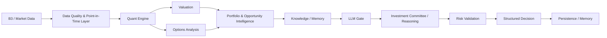

# B3 Investment & Options Agent

**Enterprise-oriented Agentic AI research project for context-aware investment decision support in the Brazilian B3 market.**

This project is the practical thesis/laboratory for postgraduate research at **PUC-Rio**, exploring how deterministic analytics, structured data, semantic knowledge and LLM-based reasoning can be combined into a traceable and reusable decision-support architecture.

> **Research / decision-support project — not an autonomous trading system and not financial advice.**

## Why this project

Investment analysis often requires combining several kinds of context:

- market and option data;
- quantitative analytics and valuation;
- portfolio context and risk;
- domain knowledge and prior decisions;
- structured reasoning and validation.

The project investigates how an agentic architecture can combine these sources while keeping deterministic calculations and risk controls outside the LLM.

## Architecture

The B3 Investment & Options Agent follows an enterprise-oriented agentic architecture:

```text
                 Dashboard
                     │
                     ▼
               Orchestrator
                     │
                     ▼
                 LangGraph
                     │
       ┌─────────────┼─────────────┐
       ▼             ▼             ▼
 Deterministic   Knowledge      Agents
    Engine        Context
       │             │             │
 Quant/Valuation  Qdrant/KG     Reasoning
 Options/Portfolio Obsidian     Synthesis
       │             │             │
       └─────────────┼─────────────┘
                     ▼
                    Risk
                     │
                     ▼
                  Decision
```

### Architectural principle

The architecture separates deterministic computation, knowledge/context retrieval, agentic reasoning and risk validation. The LLM is used for reasoning rather than as the source of numerical truth.

### Detailed flow



## Knowledge and context architecture

The project treats context as a first-class architectural concern.

Current foundations include:

- structured market and portfolio data;
- point-in-time and provenance-aware data contracts;
- deterministic quantitative and valuation engines;
- semantic knowledge through the Obsidian integration;
- persistent analytical state through SQLite / Parquet;
- controlled LLM access through an LLM Gate;
- decision persistence and memory;
- explicit architectural decisions (ADRs);
- phase freezes and validation records.

The broader research direction is to evolve this into a reusable **Knowledge Context Layer**, combining structured facts, semantic retrieval and relationship-based knowledge while preserving provenance and temporal correctness.

## Agentic AI research

The project explores agentic patterns for investment decision support, including:

- workflow orchestration and state transitions;
- specialized analytical components;
- reusable reasoning steps;
- explicit gates and validation;
- persistence and decision memory;
- evaluation and feedback loops;
- separation between deterministic tools and LLM reasoning.

The objective is not simply to add an LLM to an investment application, but to study **how context, tools, knowledge and orchestration affect the quality, traceability and reliability of agentic decisions.**

## Current capabilities

The repository currently contains dedicated components for:

- market-data provider adapters;
- quantitative analysis;
- stock valuation;
- PUT and CALL analysis;
- portfolio capital and risk;
- portfolio intelligence;
- data ingestion and repositories;
- health checks and configuration;
- automated tests and CI;
- architecture and data contracts;
- ADRs, phase freezes and change records.

## Engineering principles

1. **Deterministic first** — numerical truth stays outside the LLM.
2. **Point-in-time correctness** — avoid look-ahead and preserve temporal validity.
3. **Provenance** — decisions should be traceable to their underlying data/context.
4. **Controlled LLM usage** — reasoning is invoked deliberately, not by default.
5. **Test before freeze** — each material phase follows implementation, testing, validation and freeze.
6. **Architecture by decision** — material architectural changes are recorded as ADRs.
7. **Research transparency** — experimental capabilities are distinguished from production-ready capabilities.

## Project status

The project has progressed beyond the initial governance baseline and now includes implemented data, quantitative, valuation, options and portfolio capabilities, together with automated tests, CI and architecture governance.

### Current Dashboard phase

Dashboard development is active on `feature/mcp-mvp`.

Current state:
- Portfolio: implemented; automated E2E and manual validation completed.
- Options Intelligence: implemented; automated E2E and manual validation completed.
- Portfolio Intelligence: implemented; automated E2E and manual validation completed.
- Opportunities: placeholder.
- Copilot: implemented; Golden Cases C01–C08 are exposed and covered by automated UI/contract tests.
- Portfolio and options Excel ingestion: validated snapshot workflows.
- Brokerage-note PDF ingestion: implemented with parser, SQLite option ledger, source manifest and idempotent persistence.
- Reconciliation engine: available in backend; dedicated Dashboard UI is not yet implemented.
- Knowledge/RAG/Knowledge Graph: architectural direction/backend indicators; not yet a complete Dashboard experience.

The current Dashboard + Copilot Gate is green on commit `8634847` (CI #606 and Dashboard Gate #91).

See `docs/dashboard/` for the canonical Dashboard documentation, including architecture, use cases, testing and operations.

The next evolution is intentionally incremental: reconcile brokerage ledger data with the existing options snapshot without double counting, then implement the missing Dashboard modules and real workflow validation.

## Repository structure

```text
.
├── src/b3_agent/        # B3 application and analytical components
├── tests/               # Automated tests
├── docs/                # Architecture, contracts, ADRs and phase records
├── 00_System/           # System-level governance records
├── upstream/            # Frozen external reference implementation
└── .github/workflows/   # CI
```

## Relationship to TradingAgents

`upstream/TradingAgents` is maintained as a **frozen reference implementation**, not as the production architecture of this project.

It is used to:

1. study existing multi-agent patterns;
2. compare architectural decisions;
3. identify concepts that may be useful;
4. preserve a reproducible reference point.

The repository records the upstream version and commit used for the reference. Upstream changes are governed separately and are not adopted automatically.

This distinction is important: the B3 project has its own architecture, deterministic engines, data contracts and governance model.

## Data, privacy and secrets

No API credentials should be committed to this repository.

Local configuration belongs in `.env`, which is excluded by `.gitignore`. The committed `.env.example` contains configuration placeholders only.

Personal portfolio data, account information and other private investment records are intended to remain outside the public repository.

## Research positioning

**PUC-Rio Postgraduate Thesis / Applied Research**

The project serves as a practical laboratory for studying enterprise-oriented Agentic AI architecture, with particular emphasis on:

**context → knowledge → tools → orchestration → reasoning → validation → decision**

The central research question is how these layers can be composed to produce AI-assisted decisions that are **context-aware, traceable, reusable and operationally controllable**.

## Roadmap

The long-term roadmap is:

`DATA → QUANT → VALUATION → OPTIONS → PORTFOLIO → OPPORTUNITY RANKER → KNOWLEDGE/RAG → LLM GATE → INVESTMENT COMMITTEE → RISK → DECISION → MEMORY → BACKTEST → WALK-FORWARD → PAPER → LIVE COPILOT`

Execution is intentionally phased:

**Implement → Test → Validate → Freeze → Next phase**

## License

This repository currently **does not declare an open-source license**. The presence of an open-source license in `upstream/TradingAgents` applies to that upstream project and should not be interpreted as a license for the B3 project itself.

---

**Author:** Edmilson Fonseca  
**Focus:** Telecom & Core Networks • AI & Agentic Architecture • Digital Transformation • Decision Intelligence
