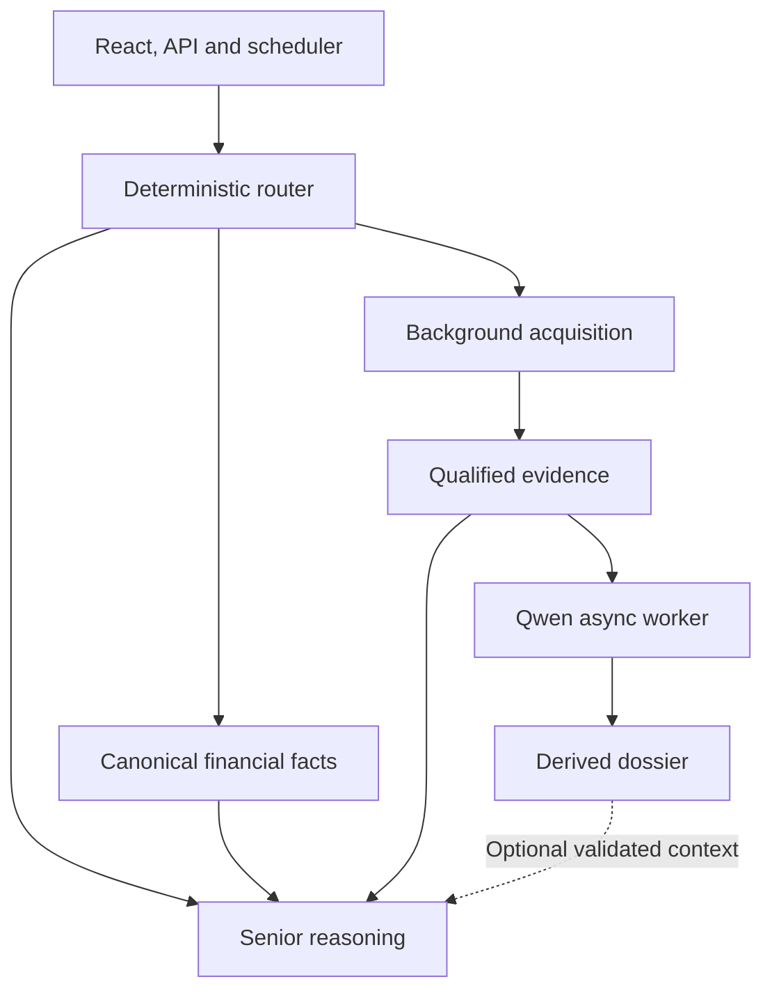

# B3 Investment & Options Agent — Architecture V4.3

**Version:** 4.3  
**Status:** IMPLEMENTED / ACTIVE HTTP VALIDATED for scoped backend closure  
**Date:** 2026-10-04  
**Base:** V4.0 + V4.1 + V4.2  
**Scope:** redefine the local Evidence analyst role as asynchronous Evidence pre-analysis and enrichment.

---

## 1. Executive decision

The local Evidence analyst defaults to Qwen3 4B Instruct 2507 Q4_K_M. DeepSeek R1 8B remains available as an alternative. Neither model is part of a mandatory senior-reasoning chain.

The new role is:

> **The local model is an asynchronous Evidence Analyst.**

It runs in background over already validated canonical Evidence and produces rebuildable derived dossiers.

It is **not**:

- a router;
- a source of truth;
- a materiality authority;
- a numerical authority;
- a required hop before OpenClaw/Luna;
- a blocker for interactive analysis;
- a mandatory producer of user-facing answers.

OpenClaw/Luna remains the senior reasoning path for ambiguous, complex or interactive questions and must be able to operate directly from canonical B3 facts and Evidence whether or not a local analyst dossier exists.

---

## 2. Why V4.3 changes the DeepSeek role

V4.2 production acceptance proved that the local model can run correctly, but also exposed the limits of putting it inline before senior reasoning.

In the real PETR4 replay:

- the canonical Evidence bundle was small;
- local DeepSeek reasoning consumed roughly three minutes;
- the model reached its configured output ceiling;
- its dossier was incomplete;
- it introduced an unsupported share-class description;
- OpenClaw/Luna correctly fell back to the canonical Evidence and preserved the Evidence limitation.

Therefore the strongest demonstrated value of DeepSeek is not “mandatory reasoning before Luna”.

Its most useful economic role is to spend otherwise idle local compute to prepare context ahead of time so that future interactive/senior analysis can reuse it without waiting for it.

---

## 3. Preserved invariants

V4.3 does not reopen V4.0–V4.2 authority decisions.

Still authoritative:

- deterministic/statistical services for prices, portfolio, options, P&L, risk and measurable facts;
- SQLite/Parquet for canonical structured truth;
- canonical Evidence for observed external facts;
- deterministic materiality before any LLM;
- PIT semantics and append-only Evidence history;
- Fast Router as deterministic routing;
- Qdrant/Neo4j as projections;
- OpenClaw/Luna as senior reasoning;
- human as final investment authority;
- no autonomous trading.

local analyst output is always **derived intelligence**.

---

## 4. V4.3 high-level architecture



Critical property:

> **OpenClaw/Luna never waits for local analyst.**

---

## 5. local analyst V4.3 responsibilities

### 5.1 Allowed

local analyst may asynchronously:

- summarize multiple already-retrieved Evidence records;
- identify repeated narratives across sources;
- identify contradictions between Evidence records;
- extract candidate risks and catalysts for later review;
- produce per-ticker overnight Evidence digests;
- produce sector/theme digests from canonical Evidence;
- prepare questions that a senior analyst should investigate;
- flag that senior review may be useful;
- summarize historical precedents already retrieved by canonical services;
- enrich derived RAG context;
- precompute background context for UC-10 and future Copilot sessions.

### 5.2 Prohibited

local analyst must not:

- decide deterministic materiality;
- create or correct canonical Evidence;
- infer authoritative issuer/security identity;
- invent prices, returns, Greeks, P&L or probabilities;
- alter portfolio/accounting truth;
- change deterministic opportunity ranking;
- create a trade recommendation as an authoritative output;
- autonomously trigger an order;
- become the only reason for senior escalation;
- block OpenClaw/Luna while local analysis is pending;
- have its claims written back into canonical Evidence.

---

## 6. Asynchronous local-analysis lifecycle

The local analysis lifecycle is explicitly separated from evidence ingestion.

```text
CANONICAL EVIDENCE
      |
      v
deterministic eligibility policy
      |
      +--> not eligible -> SKIPPED
      |
      v
ENQUEUE
      |
      v
PENDING
      |
      v
RUNNING
      |
      +--> local/runtime failure -> FAILED
      |
      v
COMPLETED
      |
      v
QUALITY GATE
      |
      +--> output limit hit / invalid refs / stale -> DEGRADED
      |
      +--> valid -> READY
```

The queue must be idempotent by an Evidence fingerprint.

Reprocessing is required when:

- the Evidence set changes;
- the prompt/policy version changes;
- the local model contract changes materially;
- the dossier becomes stale under retention policy.

---

## 7. Local Evidence Dossier contract

A local dossier is rebuildable derived intelligence.

Minimum metadata:

```json
{
  "analysis_id": "...",
  "ticker": "PETR4",
  "evidence_fingerprint": "...",
  "evidence_refs": ["..."],
  "created_at": "...",
  "model": "qwen3:4b-instruct-2507-q4_K_M",
  "prompt_version": "b3_local_evidence_analyst_v7",
  "status": "READY",
  "quality_flags": [],
  "analysis": "...",
  "thinking_chars": 0,
  "input_chars": 0,
  "eval_count": 0,
  "num_predict": 2048
}
```

The dossier does not become an Evidence object.

It may reference Evidence, but Evidence must never reference the dossier as its factual source.

---

## 8. Eligibility policy

local analyst should consume local CPU only when a background dossier has plausible reuse value.

Initial V4.3 eligibility:

- Evidence conclusion is `MATERIAL_FOUND`; and
- at least one canonical material Evidence/event exists; and
- an identical Evidence fingerprint has not already produced a current dossier.

Do not enqueue:

- `NO_MATERIAL_FOUND`;
- `COVERAGE_INSUFFICIENT`;
- deterministic price/portfolio/options calculations;
- trivial interactive lookups;
- an unchanged Evidence bundle already analyzed.

Candidates may be added later under a separate policy version.

---

## 9. Senior reasoning policy

Senior reasoning is independent of local-analysis availability.

### Interactive complex request

```text
user question
   |
   v
Fast Router -> OpenClaw/Luna
   |
   +--> canonical facts
   +--> canonical Evidence
   +--> latest READY local dossier, if exact Evidence fingerprint matches
```

If the dossier is:

- pending;
- missing;
- stale;
- failed;
- truncated;
- inconsistent with the current Evidence fingerprint;

then it is omitted.

Senior reasoning proceeds immediately.

### Scheduled background research

local analyst may finish a dossier without invoking Luna.

A dossier may create a **senior-review candidate**, but senior invocation is controlled by deterministic policy or explicit human/user demand.

---

## 10. Quality gate for local dossiers

A local analyst dossier is eligible for senior context only if all are true:

1. model call completed;
2. content is non-empty;
3. Evidence fingerprint matches the current canonical bundle;
4. every Evidence/source reference belongs to the allowed input set;
5. output did not hit the configured generation ceiling;
6. dossier is not stale;
7. no runtime failure flag exists.

Initial quality flags:

```text
OUTPUT_LIMIT_REACHED
MISSING_CONTENT
STALE_EVIDENCE
UNKNOWN_EVIDENCE_REF
MODEL_FAILURE
RUNTIME_FAILURE
```

A degraded dossier may be persisted for diagnostics but must not be injected into senior context.

---

## 11. Evidence fingerprint

The fingerprint must be deterministic and independent of local analyst.

Recommended input:

- ticker;
- sorted Evidence IDs/source refs;
- materiality state;
- relevant Evidence content hashes;
- local-analysis policy version.

This gives:

- idempotent queueing;
- stale-dossier detection;
- exact provenance matching;
- safe reuse.

---

## 12. Persistence layout

Initial filesystem implementation:

```text
data/derived/local_evidence_analyst/
    queue/
        <analysis_id>.json
    runs/
        <analysis_id>.json
    latest/
        PETR4.json
    manifests/
        latest.json
```

Later migration to SQLite is allowed without changing the contract.

All artifacts are derived and rebuildable.

---

## 13. Resource policy

The local model remains background-only.

Required controls:

- one local reasoning job at a time per host;
- low CPU priority;
- bounded context;
- bounded output;
- bounded batch count;
- no uncontrolled fan-out;
- model unload after inference unless a bounded batch is intentionally in progress;
- B3 deterministic services take priority;
- João and B3 must eventually share a host-level reasoning lock/semaphore.

A busy local model may delay local analyst analysis.

It must never delay deterministic B3 APIs or senior interactive reasoning.

---

## 14. Use-case role in V4.3

| Use case | Local Evidence Analyst | OpenClaw/Luna |
|---|---|---|
| UC-01 Portfolio | optional overnight narrative enrichment | complex interpretation |
| UC-02 Options | optional background risk digest | strategy discussion |
| UC-03 Opportunity | enrich already-canonical candidates | deep candidate review |
| UC-04 What-if | no critical role | interactive synthesis |
| UC-05 Regime | optional narrative enrichment | cross-domain reasoning |
| UC-06 Factors | optional explanation cache | nuanced interpretation |
| UC-07 History | background precedent digest | precedent reasoning |
| UC-08 Learning | draft-only candidate context | human-facing implications |
| UC-09 Similarity | summarize retrieved precedents | comparison |
| UC-10 Research | **primary local analyst use case** | senior review only when needed |
| UC-11 Stress | optional explanation cache | strategic implications |
| UC-12 Copilot | precomputed optional context | **primary conversational reasoning** |

---

## 15. Router change

V4.3 preserves the deterministic Fast Router.

Scheduled UC-10 research continues to route to a background target, but the semantic target changes from:

```text
"run local analyst inline"
```

to:

```text
"prepare/enqueue local Evidence analysis"
```

Complex or ambiguous user requests continue directly to OpenClaw/Luna.

No LLM is introduced into routing.

---

## 16. V4.2 compatibility

V4.3 supersedes only the mandatory shape implied by V4.2 section 27:

```text
Canonical Evidence -> local analyst -> escalation -> Luna
```

with:

```text
Canonical Evidence -------------------------------> Luna
       |
       +--> async local analyst dossier --optional----> Luna context
```

All V4.2 acquisition, Evidence, PIT, issuer mapping, materiality and coverage rules remain unchanged.

Gate A/B/C/D history remains valid as evidence that the components work; V4.3 changes orchestration, not the factual authority model.

---

## 17. Implementation components

V4.3 introduces:

```text
src/b3_agent/intelligence/local_evidence_analysis.py
    LocalEvidenceAnalysisRequest
    LocalEvidenceDossier
    LocalEvidenceQueue
    LocalEvidenceAnalyst
    LocalEvidenceContextSelector

src/b3_agent/jobs/local_evidence_analyst.py
    LocalEvidenceAnalystJob

scripts/run_local_evidence_analyst.py
```

Nightly UC-10 becomes:

```text
retrieve + normalize + materiality
        |
        +--> persist canonical/research result
        |
        +--> enqueue local-analysis request
```

The separate worker consumes the queue.

---

## 18. V4.3 acceptance criteria

V4.3 implementation is acceptable when:

- V4.0–V4.2 regression tests remain green;
- material Evidence can be queued idempotently;
- no-material and coverage-gap states do not enqueue;
- worker processes queued Evidence in background;
- local dossier is stored separately from canonical Evidence;
- output-limit detection marks the dossier degraded;
- unknown Evidence refs prevent dossier reuse;
- senior context selection never waits for local analyst;
- missing/pending/failed/degraded dossier returns canonical Evidence context immediately;
- exact-current READY dossier can be added as optional secondary context;
- Fast Router remains deterministic;
- OpenClaw/Luna remains independently callable from canonical Evidence;
- local analysis remains bounded and background-only.

---

## 19. Migration rule

Do not delete the existing V4.2 acceptance replay.

It remains a component validation tool.

Production orchestration should migrate toward the V4.3 async local-analysis contract.

---

## 20. V4.3 frozen decision

The architectural decision introduced by V4.3 is:

> **Qwen3 4B Instruct 2507 Q4_K_M is the default asynchronous local Evidence Analyst; DeepSeek R1 8B remains an alternative whose output is optional derived context. OpenClaw/Luna senior reasoning must never depend on local analyst availability or completion.**

This change is motivated by observed production behavior and preserves all deterministic, Evidence, PIT, no-autonomous-trading and human-authority invariants.


---

## 21. As-built runtime validation — 2026-09-30

V4.3 was validated on the production Ubuntu host with real PETR4 CVM Evidence.

The staged acceptance proved:

- canonical Evidence acquisition/materiality completed before local reasoning;
- enqueue returned in approximately 2.6 seconds;
- local analyst was not invoked inline;
- the separate local worker consumed the queued request;
- local analyst produced a degraded dossier after reaching the 768-token ceiling;
- the quality gate marked it `DEGRADED` with `INVALID_JSON` and `OUTPUT_LIMIT_REACHED`;
- the senior context builder omitted the degraded dossier;
- canonical Evidence remained available to the senior path;
- all three runtime stages returned zero;
- final marker: `V4_3_ACCEPTANCE=PASS`.

This negative-path validation is intentional evidence for the V4.3 architecture: local-model quality failure does not block or contaminate senior reasoning.

V4.3 is therefore implemented and runtime validated.

Repository merge/freeze sequencing remains separate because V4.3 is stacked on the V4.2 branch, whose CVM RAD live Gate D depends on external credentials.


---

## 22. Continuous Intelligence Loop

V4.3 extends the asynchronous local Evidence Analyst into a continuous intelligence loop.

The objective is to continuously discover new public/official information, normalize it into canonical Evidence, apply deterministic relevance/materiality filters, and use local analyst only as asynchronous derived-intelligence enrichment.

The continuous loop must preserve the V4.3 critical invariant:

> **Discovery and canonical Evidence ingestion never wait for local analyst.**

### 22.1 Source hierarchy

The continuous loop uses the following CVM/public channels with distinct roles.

| Source | Authentication | V4.3 role |
|---|---:|---|
| CVM Dados Abertos — https://dados.cvm.gov.br | none | historical backfill, reconciliation, registry and public canonical datasets |
| CVM Dados Abertos / Companhias — https://dados.cvm.gov.br/dataset?groups=companhias | none | company datasets, IPE/FCA/CAD discovery and reconciliation |
| Empresas.NET / ENET — https://www.rad.cvm.gov.br/ENET/frmConsultaExternaCVM.aspx | none for public queries | public consultation/document retrieval and manual/diagnostic fallback |
| CVMWEB — http://sistemas.cvm.gov.br | none for public consultation | supplemental public consultation; not a critical automation dependency |
| CVM Download Múltiplo | authenticated credentials | near-real-time incremental discovery of newly filed documents |

Credentials for Download Múltiplo are runtime secrets only and must never be committed to Git.

### 22.2 Continuous loop

```text
               OFFICIAL/PUBLIC SOURCES
                         |
        +----------------+----------------+
        |                                 |
        v                                 v
CVM Download Múltiplo               Open Data / ENET
near-real-time discovery           reconciliation/backfill
        |                                 |
        +----------------+----------------+
                         |
                         v
                 CANONICAL EVIDENCE
                         |
                         v
               DETERMINISTIC TRIAGE
            issuer / ticker / source
          category / materiality / age
             dedupe / portfolio scope
                         |
          +--------------+---------------+
          |                              |
          v                              v
      SKIP/STORE                   LOCAL ANALYSIS QUEUE
  no model required                       |
                                          v
                               QWEN ASYNC ANALYST
                                 relevance/enrichment
                                          |
                                 +--------+--------+
                                 |                 |
                                 v                 v
                              READY            DEGRADED
                                 |                 |
                                 v                 v
                        optional derived       diagnostics only
                        intelligence context
                                 |
                                 v
                         SENIOR REVIEW POLICY
                                 |
                       deterministic trigger
                          or human request
                                 |
                                 v
                           OPENCLAW / LUNA
```

### 22.3 Deterministic triage before local analyst

New Evidence must not be sent indiscriminately to the local model.

The deterministic prefilter evaluates:

- canonical issuer identity;
- ticker mapping;
- portfolio/watchlist membership;
- source authority;
- disclosure/document category;
- deterministic materiality;
- freshness;
- duplicate/provider-record identity;
- Evidence content hash;
- whether an equivalent Evidence fingerprint has already been analyzed.

Initial enqueue policy:

1. `MATERIAL` official Evidence for monitored issuers -> always eligible for local background enrichment;
2. `CANDIDATE` official Evidence for monitored issuers -> eligible for local relevance screening;
3. open-web Evidence -> eligible only after minimum coverage/source-quality rules and ticker mapping;
4. `NON_MATERIAL`, duplicates and already-current fingerprints -> persist/skip without local inference;
5. `COVERAGE_INSUFFICIENT` remains a coverage state, not a reason to invent relevance.

local analyst never changes the canonical deterministic materiality classification.

### 22.4 Two-stage local reasoning

To reduce latency and avoid the observed 768-token truncation failure, V4.3 continuous intelligence should use two distinct local tasks.

#### Stage A — Local relevance screen

A small structured-output request answers only:

```json
{
  "relevance": "RELEVANT | POSSIBLY_RELEVANT | NOT_RELEVANT | UNKNOWN",
  "themes": ["..."],
  "reason": "...",
  "senior_review_candidate": false,
  "evidence_refs": ["..."]
}
```

Properties:

- small context;
- small output ceiling;
- deterministic JSON Schema;
- no recommendation;
- no numerical invention;
- no canonical-state mutation.

For official `MATERIAL` Evidence, a local analyst `NOT_RELEVANT` result cannot suppress the Evidence or remove it from senior availability.

For `CANDIDATE` Evidence, relevance output remains derived intelligence.

#### Stage B — Local Evidence dossier

Only Evidence that survives deterministic eligibility and local relevance screening proceeds to the larger dossier task.

The dossier produces:

- concise summary;
- candidate risks;
- candidate catalysts;
- contradictions;
- missing information;
- questions for senior review;
- exact Evidence refs.

A dossier that is invalid, truncated, stale or uses unknown refs is `DEGRADED` and is excluded from senior context.

### 22.5 Scheduling policy

Default operational target:

- Download Múltiplo incremental discovery: configurable frequent polling on business days;
- conservative initial cadence: every 15 minutes during the active monitoring window;
- Open Data reconciliation: once daily;
- local Evidence analyst worker: separate timer after discovery and periodically drain a bounded queue;
- catch-up/reconciliation run after host downtime;
- all cadences configurable through runtime environment, not hard-coded business logic.

The implementation must use a durable discovery cursor with a small overlap window so restart or transient source failure does not create gaps.

Polling must be respectful of source capacity; no uncontrolled parallel requests or aggressive scraping.

### 22.6 Incremental discovery cursor

The Download Múltiplo path must persist:

- last successful query date/time;
- last observed provider record IDs;
- query overlap window;
- last source error;
- last successful retrieval timestamp.

On each poll:

```text
previous cursor
      |
      v
query [cursor - overlap, now]
      |
      v
dedupe by provider identity/content hash
      |
      v
persist new canonical Evidence
      |
      v
advance cursor only after successful persistence
```

A failed query must not advance the cursor.

### 22.7 Senior escalation policy

local analyst may propose `senior_review_candidate=true`, but that field alone is insufficient to invoke OpenClaw/Luna automatically.

Automatic senior escalation requires a deterministic policy, for example:

- official MATERIAL Evidence for an owned position;
- configured portfolio-risk threshold;
- multiple independent canonical Evidence records on the same theme;
- explicit user request;
- another deterministic UC trigger.

If no deterministic senior trigger exists, the local dossier remains cached derived intelligence for future use.

### 22.8 Continuous intelligence observability

Backend observability should expose at least:

```text
GET /intelligence/local/status
GET /intelligence/local/queue
GET /intelligence/local/{ticker}
GET /intelligence/local/manifest
```

The UI/API must keep these concepts visibly separate:

- canonical Evidence;
- deterministic materiality;
- local derived-intelligence status;
- whether a local dossier was accepted or omitted;
- quality flags;
- last source poll / cursor;
- backlog size.

### 22.9 Shared-host resource arbitration

Continuous scheduling makes cross-project Ollama arbitration a production requirement.

B3 and João must share one host-level heavy-reasoning lock/semaphore.

Target contract:

```text
/var/lock/local-reasoning.lock
              |
       +------+------+
       |             |
       v             v
      B3            João
       \             /
        +--- flock --+
```

Only one heavy local inference may run at a time.

A busy lock delays/requeues local analysis; it never delays canonical Evidence ingestion, deterministic APIs or OpenClaw/Luna interactive reasoning.

### 22.10 Continuous-loop acceptance

The continuous intelligence extension is accepted only when all are demonstrated:

- authenticated Download Múltiplo discovery works with runtime secrets;
- no credentials appear in Git/log artifacts;
- cursor restart/catch-up does not lose Evidence;
- repeated polling is idempotent;
- official MATERIAL Evidence is persisted immediately;
- candidate Evidence can enter local relevance screening;
- local analyst is never called inline by source ingestion;
- relevance-screen structured output is bounded and validated;
- degraded local output cannot suppress canonical Evidence;
- local worker is bounded and serialized;
- B3/João shared-host lock works;
- backend observability exposes queue/dossier/source-cursor status;
- daily Open Data reconciliation detects/reconciles missed records;
- senior reasoning remains fully functional when local analyst is absent, busy or degraded.


---

## 23. As-built production freeze — 2026-09-30

V4.3 Continuous Intelligence is production validated and frozen.

The as-built production loop is:

```text
CVM Download Múltiplo
        |
        v
durable cursor + overlap
        |
        v
canonical Evidence + append-only dedupe
        |
        v
deterministic materiality + triage
        |
        +--> NON_MATERIAL / out of scope -> store/skip
        |
        +--> CANDIDATE -> short async relevance screen
        |                    |
        |                    +--> relevant -> dossier queue
        |                    +--> non-ready -> defer/omit
        |
        +--> MATERIAL ----------------------> dossier queue
                                                |
                                                v
                                      local analyst async worker
                                                |
                                     READY -----+----- DEGRADED/DEFERRED
                                        |                 |
                                        v                 v
                               optional derived       diagnostics/requeue
                               senior context          never canonical
                                        |
canonical Evidence --------------------+-----------------> OpenClaw/Luna
                                                          |
                                                          v
                                                        HUMAN
```

Operational invariants frozen by this version:

1. canonical Evidence acquisition never waits for local analyst;
2. deterministic materiality always precedes local LLM reasoning;
3. local analyst output is derived intelligence only;
4. a local-model failure is deferred/requeued and cannot suppress official Evidence;
5. a local analyst `NOT_RELEVANT` result cannot suppress deterministic official `MATERIAL`;
6. only READY/current/reference-valid dossiers may enter senior context;
7. OpenClaw/Luna never waits for local analyst;
8. B3 and João share one host-level local reasoning lock;
9. discovery cursor advances only after successful Evidence persistence/routing;
10. Open Data reconciliation never rewrites historical reconstruction as observed-live Evidence;
11. official issuer/security identity is deterministic;
12. CVM FCA trading codes admitted to the registry must match `[A-Z]{4}[0-9]{1,2}`;
13. no autonomous trading is introduced.

Production acceptance markers:

```text
V4_3_CONTINUOUS_ACCEPTANCE=PASS
PRODUCTION_TIMERS=PASS
PRODUCTION_DISCOVERY=PASS
OBSERVABILITY_API=PASS
SHARED_LOCAL_REASONING_LOCK=PASS
BACKEND_CONTINUOUS_READY=PASS

V4_3_IDENTITY_ACCEPTANCE=PASS
B3_RUNTIME_READY=PASS
PETR4_HTTP=200
PSEUDO_TICKER_1_HTTP=400
V4_3_IDENTITY_RUNTIME=PASS
```

Final pre-freeze CI:

- GitHub Actions CI #1130;
- Python: 623 passed;
- React: PASS.

Detailed freeze record:

`docs/V4.3_CONTINUOUS_INTELLIGENCE_FREEZE_2026-09-30.md`


## 2026-10-03 implementation update

The dedicated B3_LOCAL_EVIDENCE_MODEL controls the dossier worker without changing global model routing. Default context 4096, output cap 2048, temperature 0 and timeout 600. Per-request structured generation restricts source references; post-validation rejects malformed fields, unknown references and truncation.

The nightly producer monitors portfolio plus watchlist, refreshes stored dividend snapshots and reviewed institution reports, and discovers new primary report URLs. Bounded XP, Safra, Itaú and BTG primary report parsers admit only explicit, qualified targets. Current reviewed coverage includes XP ITUB4/BBDC4, Safra LIGT3 and Itaú VALE3; no current BTG target was admitted. Unsupported layouts, stale reports and inaccessible sources remain explicit coverage gaps. Interactive BUY and Opportunities reuse snapshots without provider dividend calls.

The existing filesystem queue supports exclusive consumers, twenty-minute abandoned-running leases, runtime-failure backoff capped at three attempts, terminal audit retention and bounded sequential draining. Existing scheduled CLI drains at most twenty batches within 1800 seconds plus at most one in-flight model request. Actual two-batch Qwen acceptance: 2 READY in 50.3591 seconds, zero failed/degraded/deferred, run 37167068552.

See docs/BACKEND_ASYNC_COMPLETION_2026-10-03.md and final backend acceptance checkpoint for active HTTP evidence, source coverage limitations and remaining frontend visual acceptance. Historical DeepSeek measurements in section 2 explain the original architectural decision and are not the current worker default.

## 2026-10-03 end-of-day operational decision (UTC 2026-10-04)

The dedicated worker uses `qwen3:4b-instruct-2507-q4_K_M`, `think=false`, context 4096 tokens, generation ceiling 2048 tokens, temperature 0 and request timeout 600 seconds. This changes the B3 evidence worker default, not global Ollama routing or the senior financial agent. OpenClaw/Luna still interprets canonical financial inputs; Python owns financial calculations.

Prompt v7 requires a summary of at most 400 characters and at most two entries of 200 characters in each analytical list. JSON schema, allowed references and post-validation gate admission; oversized or invalid output is DEGRADED, never silently repaired into canonical truth. READY means contract admission, not proof of every semantic assertion.

Production consumer cadence observed on Ubuntu: `Mon..Fri *-*-* *:10/15:00`. The nightly acquisition producer and periodic queue consumer are distinct. Durable queue leases, bounded retry/backoff and a host-level reasoning lock serialize work. Source ingestion and interactive senior analysis never wait for Qwen.

Actual catch-up run 37169940668 processed 10 pending items into 10 READY, zero failed/degraded/deferred and zero remaining, in 1095.9 seconds. Broad isolated replay passed both dividends and stored news; the news replay does not certify current feed freshness. No sustained-throughput or financial-accuracy superiority is inferred from these measurements.

The dividend producer supports Bradesco RI monthly JCP fallback for BBDC3/BBDC4 with gross ON/PN separation and partial coverage. Future scheduled declarations are not announced income. A remaining boundary correction must classify declaration days in America/Sao_Paulo rather than UTC.

Final candidate Ubuntu run 37169879967 passed CI gating, primary acquisition, real Qwen draining, workspace contracts and senior economic comparisons. Checkout update succeeded; authenticated sudo restart was blocked. Active legacy HTTP health/history checks do not prove activation of the new primary dividend reader.

Detailed closure and tomorrow's sequence: `docs/BACKEND_PENDING_CLOSURE_2026-10-04.md`, `docs/NEXT_STEPS_BACKEND_2026-10-04.md` and `docs/RESTART_PROMPT_BACKEND_2026-10-04.md`. New React visual acceptance and the full AC01–28 contract are not closed by these backend measurements.

## Active backend closure — 2026-10-04 09:41 America/Sao_Paulo

Block 1 step 4 and block 4 steps 1–5 are CLOSED for the scoped backend work. Corrected runtime revision: `a3dced7729f460187aaf44ba6a9809101bcc95d5`. Full local suite: 924 passed; CI run 37202675923 SUCCESS; Ubuntu focused regression: 21 passed. Authenticated service restart completed at 09:40:07 -03, PID 9790, after installation of the corrected provider.

Active HTTP acceptance: run 37202797469 attempt 2, job 111438148765 SUCCESS, `ACTIVE_PROCESS_AFTER_INSTALL=PASS` and `ACTIVE_BACKEND_CLOSURE=PASS`. Health returned HTTP 200. BUY ITUB4 × BBDC4: HTTP 200 in 2914.9 ms; stored dividends READ_OK with 19/12 events; qualified institution target counts 1/1. BBDC4 primary RI source, 12 monthly gross PN amounts and PARTIAL_MONTHLY_JCP_ONLY were asserted; scheduled unannounced events retained unknown announcement dates. Economic scenario comparison: HTTP 200 in 1498.6 ms. Opportunities: HTTP 200 in 1812.8 ms, two qualified institution target potentials. Both economic comparisons conserved cash; all focused interactive responses used zero LLM calls and stored dividend snapshots.

This validates deterministic active API behavior; no new senior synthesis or Qwen throughput benchmark was run. Earlier senior/worker acceptance remains separate evidence. No production queue catch-up was repeated. Reports remain private on Ubuntu. Scope closure does not certify all AC01–28, full complementary dividends, current BTG target coverage or Outcome/Experience/Learning ownership.

Next work: new React implementation and visual acceptance against `docs/FRONTEND_FUNCTIONAL_SPEC_V1.0.md` (document title V1.1 FINAL). Backend activation is complete; frontend work remains open.
