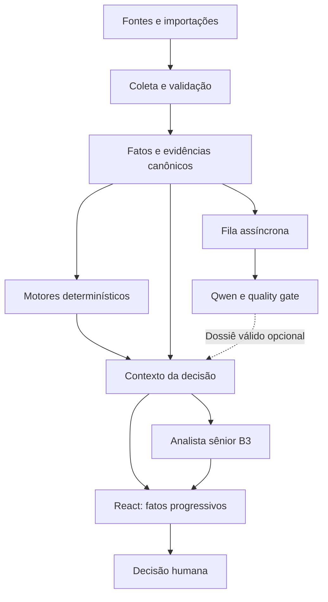

# B3 Investment & Options Agent — Arquitetura V4.4

**Data:** 05/10/2026  
**Status:** ARQUITETURA-ALVO FINAL CONSOLIDADA — implementação e aceite ponta a ponta pendentes por capacidade  
**Escopo:** inteligência integrada de ações e opções, Opportunities, Strategy Lab, Market Intelligence, coleta, política de fontes, Qwen assíncrono e frontend React.  
**Autoridade:** consolida as decisões do usuário nesta revisão. Preserva os invariantes V4.0–V4.3 e substitui, nos assuntos tratados aqui, prioridades de fontes e requisitos de produto anteriores.

> Publicar esta arquitetura não significa que suas capacidades estejam implantadas. A V4.4 define o comportamento final esperado; estados de implementação, cobertura real e versão ativa devem ser comprovados separadamente.

## Revisão funcional aprovada em 05/10/2026

A [especificação V1.2](FRONTEND_DECISION_WORKSPACES_SPEC_V1.2.md) detalha os fluxos e é normativa para as três telas. Opportunities descobre teses sobre ações ao abrir a aplicação, permite nova busca e não varre cadeias de opções automaticamente; opções possuídas compõem o contexto. Não há encaminhamento obrigatório após a leitura. Strategy Lab recebe perguntas e teses no painel central; Market Intelligence interpreta panorama e ativos. Esta revisão prevalece sobre descrições mais amplas de descoberta automática nas seções 10 e 16, mantendo as estratégias detalhadas sob demanda no Lab. [Gaps e entregas](FRONTEND_V44_GAPS_AND_DELIVERY_2026-10-05.md) registram implementação e evidências separadamente.

## 1. Base documental e estado da revisão

Código inspecionado: branch `feature/react-functional-v43-integration`, commit `5ccb458cf81fa3cb2f5f1c3d7f30bb7fd4bace9e`, checkout limpo na revisão. PR relacionado: [#66](https://github.com/edmilsonandradefonseca/b3-investment-options-agent/pull/66), aberto/draft na consulta. Não houve alteração de código funcional nesta revisão.

A branch `main` consultada estava em `cb669f5519f186857e3297393d67fc2bde83ac5a`, anterior à integração revisada. Este documento é publicado diretamente em `main/docs` por solicitação do usuário; isso não incorpora o PR #66 nem muda Windows/Ubuntu.

Referências fixadas à revisão consultada, pois algumas ainda não existem em main:

- [Arquitetura V4.3](https://github.com/edmilsonandradefonseca/b3-investment-options-agent/blob/5ccb458cf81fa3cb2f5f1c3d7f30bb7fd4bace9e/docs/ARCHITECTURE_V4.3.md).
- [Especificação funcional e UX V1.1 FINAL — arquivo V1.0](https://github.com/edmilsonandradefonseca/b3-investment-options-agent/blob/5ccb458cf81fa3cb2f5f1c3d7f30bb7fd4bace9e/docs/FRONTEND_FUNCTIONAL_SPEC_V1.0.md).
- [Casos de uso V2.0](https://github.com/edmilsonandradefonseca/b3-investment-options-agent/blob/5ccb458cf81fa3cb2f5f1c3d7f30bb7fd4bace9e/docs/USE_CASES_INVESTMENT_OPTIONS_V2.0.md).
- [Delivery plan AC-01–AC-28](https://github.com/edmilsonandradefonseca/b3-investment-options-agent/blob/5ccb458cf81fa3cb2f5f1c3d7f30bb7fd4bace9e/docs/DECISION_WORKSPACES_DELIVERY_PLAN_2026-10-02.md).
- [UC-04 cenários explícitos](https://github.com/edmilsonandradefonseca/b3-investment-options-agent/blob/5ccb458cf81fa3cb2f5f1c3d7f30bb7fd4bace9e/docs/UC04_EXPLICIT_SCENARIO_COMPARISON_BLOCK_2026-10-02.md).
- [Checkpoint de inteligência do frontend](https://github.com/edmilsonandradefonseca/b3-investment-options-agent/blob/5ccb458cf81fa3cb2f5f1c3d7f30bb7fd4bace9e/docs/NEXT_STEPS_FRONTEND_INTELLIGENCE_2026-10-05.md).

O documento consolidado João+B3 V4.1 de 28/09 foi lido como direção histórica. Em caso de conflito, V4.3 rege o papel assíncrono do modelo local e V4.4 rege os novos requisitos aqui definidos. A navegação final de cinco workspaces prevalece sobre o plano inicial de nove páginas.

## 2. Objetivo de produto e cobertura

Entregar apoio à decisão que responda: o que merece atenção, quais alternativas existem, como se comparam e qual seu impacto sobre a carteira completa.

Dois universos distintos:
1. **Carteira vigente completa:** todas as ações e opções compradas/vendidas, capital, obrigações, cobertura e exposição.
2. **Universo B3 analisável:** ações e opções fora da carteira, candidatos/watchlist e consultas sob demanda, com identificação e cobertura declaradas.

Não restringir o produto aos ativos dos testes ou a uma lista fixa de vinte ações. Processar universos grandes em lotes/páginas sem omissão silenciosa. Cobertura integral da carteira não significa promessa de dados completos de todos os instrumentos listados na B3.

Uma nova importação válida de posição substitui o snapshot corrente; notas de corretagem são aditivas e deduplicadas. Snapshot inválido não substitui o último válido. Histórico não deve reintroduzir posições encerradas na carteira atual.

## 3. Invariantes e autoridades

- Python e serviços determinísticos são autoridade para preços admitidos, quantidades, capital, P&L, payoff, risco, normalização e ranking quantitativo.
- SQLite/Parquet e os stores canônicos existentes preservam fatos e histórico. Não criar ledger paralelo.
- Qdrant/Neo4j são projeções de recuperação e relacionamento, não autoridade contábil.
- Qwen produz inteligência derivada opcional. Não altera fatos, ranking ou materialidade oficial.
- O analista sênior B3 via OpenClaw interpreta fatos e evidências; pode apresentar preferência qualitativa condicionada, claramente separada do ranking calculado.
- Fast Router permanece determinístico; tarefas complexas não precisam passar pelo Qwen.
- Unknown permanece desconhecido, mas uma lacuna bloqueia somente as conclusões que dependem dela.
- Fonte, datas, metodologia, hipóteses e qualidade acompanham cada resultado relevante.
- Nenhuma ordem de corretagem automática. A decisão final é humana.

## 4. Fluxo lógico

Fatos devem aparecer primeiro. A síntese usa a mesma revisão de contexto, sem misturar uma cotação nova com carteira ou cenário antigos. João pode oferecer perspectiva de pesquisa quando necessária, mas não será uma etapa síncrona obrigatória em toda pergunta. Medir seu ganho antes de manter uma chamada adicional.

## 5. Política de fontes — decisão V4.4

**Regra mandatória:** reutilizar dados locais ainda válidos; para dados de ações suportados, buscar **Yahoo/yfinance → OPLAB → BRAPI**. BRAPI só será consultada quando Yahoo e OPLAB não fornecerem informação admissível para a necessidade.

| Domínio | Prioridade / autoridade |
|---|---|
| Preço, volume e histórico de ações | Cache/série validada; Yahoo; OPLAB; BRAPI |
| Demonstrações, múltiplos e dados cadastrais analíticos | Yahoo; capacidade OPLAB quando existente; BRAPI como último recurso; CVM/RI para complemento/verificação oficial |
| Opções B3: identidade, cadeia, bid/ask, IV e Greeks | OPLAB como principal; não presumir cobertura equivalente em Yahoo ou BRAPI |
| Proventos e eventos corporativos | Yahoo para enriquecimento; demais provedores conforme capacidade; eventos oficiais reconciliados com RI/CVM/B3 |
| Consenso, estimativas e revisões de analistas | Yahoo, explicitamente identificado como agregado |
| Alvos/recomendações individuais de casas | Relatório original verificável de XP, BTG, Safra, Itaú e demais fontes suportadas |
| Documentos corporativos oficiais | CVM Dados Abertos, Download Múltiplo e RI |
| Macro oficial | Banco Central SGS e fontes oficiais adequadas |
| Notícias | Yahoo + busca SearXNG/Google News conforme configuração; manter editor/link original |
| Carteira e transações pessoais | Extrato BTG, notas e entradas explícitas do usuário |

Fontes oficiais não perdem autoridade por causa da prioridade de consulta de agregadores. Não chamar um fornecedor para capacidade que ele não oferece. Registrar `unsupported` e seguir para a próxima fonte aplicável.

Fallback por campo/capacidade, quando ausente, inválido, desatualizado, incompatível ou indisponível. Resultado vazio não é sucesso de cobertura. Não misturar períodos, moedas, classes, ajustes ou escalas. Divergência material gera diagnóstico; não escolher silenciosamente o número mais conveniente.

### 5.1 Proteção da franquia BRAPI

Limite informado pelo usuário: **15.000 requests/mês**.
- Contador persistente, compartilhado por API e jobs, com reserva atômica antes da chamada.
- Contabilizar tentativas/retries conservadoramente e reconciliar com consumo do provedor quando disponível.
- Registrar saldo inicial/consumo externo: contador local não prova saldo da conta se outros clientes usam a mesma credencial.
- Configurar ciclo de cobrança e fuso conforme conta; não presumir reset pela data UTC.
- Cache, coalescência de requests idênticos, lote quando suportado e retry limitado.
- Alertas propostos em 70%, 85% e 95%; reserva operacional configurável e bloqueio antes do teto.
- Se o saldo confiável for desconhecido, operar com orçamento conservador explicitamente configurado.
- Toda chamada registra a necessidade e por que Yahoo/OPLAB não atenderam, sem expor tokens.
- Frontend e Copilot não chamam BRAPI diretamente.

### 5.2 Yahoo/yfinance

Promover de piloto de histórico para adapter completo, após validar cobertura por ticker/capacidade.

| Conjunto | Métodos/campos de referência | Tratamento |
|---|---|---|
| OHLCV e histórico | history/download | Moeda, calendário, timezone, período e frequência explícitos |
| Intraday | interval 1m…1h | Respeitar retenção, atraso, pregão parcial e limites observados |
| Eventos | dividends/splits/actions | Separar ex-date, pagamento e anúncio quando conhecidos; identificar JCP sem inferência |
| Demonstrações | income_stmt, balance_sheet, cashflow e variantes trimestrais | Unidade, período fiscal, consolidado e TTM distintos |
| Múltiplos/perfil | info/fast_info | Semântica setorial e origem do denominador |
| Recomendações | recommendations, upgrades_downgrades | Agregado distinto de opinião individual identificada |
| Alvos | analyst_price_targets | current é preço de referência, não um alvo; low/high/mean/median são agregados |
| Expectativas | earnings_estimate, revenue_estimate, eps_trend, eps_revisions | Horizonte, amostra e dispersão; não lucro observado |
| Agenda/notícias | calendar, earnings_dates, news | Estimado versus confirmado; publicação, evento e link original |

Não garantir preenchimento brasileiro por existir método na biblioteca. Não tratar consenso agregado como relatório de uma casa ou probabilidade de retorno.

Configurar `auto_adjust` explicitamente. Preservar bruto/ajustado, eventos e flags de reparo; não aplicar ajustes duas vezes. `repair=True` não certifica correção. Não concatenar fontes incompatíveis. COTAHIST existente permanece referência histórica e não é sobrescrito indiscriminadamente.

Demonstrações e consenso coletados hoje não provam disponibilidade histórica: guardar `retrieved_at`, `available_at` quando conhecido, período e revisões. Sem disponibilidade comprovada, não admitir em backtest point-in-time.

O piloto anterior foi somente leitura, cinco ações e histórico. Suas divergências com COTAHIST não rejeitam todas as capacidades Yahoo e também não validam o adapter completo.

Documentação técnica: [yfinance](https://ranaroussi.github.io/yfinance/), [Financials](https://ranaroussi.github.io/yfinance/reference/yfinance.financials.html), [Analysis](https://ranaroussi.github.io/yfinance/reference/yfinance.analysis.html), [History](https://ranaroussi.github.io/yfinance/reference/yfinance.price_history.html).

## 6. Coleta e atualização

Separar coleta, cálculo, triagem e inferência. O modelo local não navega autonomamente: recebe evidências já coletadas.

### 6.1 Estado encontrado versus política-alvo

| Rotina | Estado encontrado no código/checkpoints | Direção V4.4 |
|---|---|---|
| CVM incremental | Dias úteis, minutos 00/15/30/45 | Preservar cursor, overlap e idempotência; verificar execução ativa |
| Triagem local | Dias úteis, 05/20/35/50 | Preservar; verificar modelo efetivo da triagem separadamente do dossier |
| Dossiês Qwen | Dias úteis, 10/25/40/55; frequência registrada no Ubuntu em 03/10 | Consumir fila, sem sobreposição e sem bloquear interação |
| Reconciliação CVM | Dias úteis 20h30 São Paulo | Preservar e verificar sucesso |
| Coleta noturna ampliada | Dias úteis 22h São Paulo | Carteira + subjacentes das opções + watchlist; notícias, documentos, proventos e research |
| Macro | Instalador prevê 19h São Paulo em dias úteis | Atualizar conforme publicação de cada série |
| Preços/cadeias interativos | Consultas existentes | Atualizar on-demand conforme freshness da tarefa e reutilizar cache |
| Revisão integral da carteira | Não comprovada como rotina completa | Adicionar cálculo de cobertura, obrigações, vencimentos e alternativas |

Os timers de 15 minutos encontrados não fixam timezone; V4.4 exige `America/Sao_Paulo` explícito. Usar calendário de negociação para tarefas de mercado; segunda a sexta não é sinônimo de pregão. Fontes corporativas podem publicar fora do pregão; garantir catch-up após finais de semana/indisponibilidade.

Política adicional proposta, a validar por quotas/latência:
- pré-abertura: agenda e eventos novos; usar último fechamento quando apropriado;
- durante pregão: snapshots dos contratos possuídos e candidatos ativos em lotes; cadência inicial de 15 minutos apenas onde permitida e útil;
- dados para comparação/fechamento: confirmar freshness on-demand, não reutilizar um snapshot de 15 minutos como preço executável garantido;
- após fechamento: consolidar candle diário e recalcular métricas;
- fundamentos, estimativas e consenso: atualização diária, acelerada por divulgação relevante;
- toda a base B3: descoberta gradual em background, não todas as cadeias a cada 15 minutos.

A rotina noturna enriquece dados; não significa atualizar integralmente todo o mercado. Medir cobertura e recursos antes de ampliar cadência.

### 6.2 Coleta incremental

Persistir IDs/hashes, cursor, tentativa, sucesso, erro e cobertura. Cursor só avança após persistência. Repetição não duplica eventos. Recuperação de atraso é limitada e prioriza posições reais, vencimentos próximos e pedidos explícitos. Toda lacuna deve informar qual decisão afeta.

## 7. Qwen assíncrono e análise sênior

Baseline revisada do dossier: `qwen3:4b-instruct-2507-q4_K_M`, `think=false`, contexto 4096, saída máxima 2048 tokens, temperatura 0 e timeout 600 s. DeepSeek é alternativa; não alterar roteamento global por conveniência.

Saída atual: resumo até 400 caracteres; até duas entradas curtas em riscos, catalisadores, contradições e perguntas para senior; referências permitidas. Esses limites são adequados a um digest, não à resposta financeira completa.

V4.4:
- segmentar documentos extensos com rastreabilidade e extrair fatos estruturados antes do resumo;
- preservar documento canônico, contradições e omissões; senior acessa a evidência original relevante;
- relacionar riscos/catalisadores aos ativos e horizontes; exposição numérica vem dos engines;
- reaproveitar dossier apenas READY, atual, íntegro e com fingerprint exato;
- rejeitar schema inválido, referências desconhecidas e truncamento;
- fila idempotente, um processamento pesado por host, lock compartilhado João/B3, timeout, lease e retries limitados;
- não reprocessar evidência idêntica sem mudança de política/modelo;
- READY significa admissão do contrato, não garantia de verdade semântica;
- pesquisa/ingestão e análise sênior nunca esperam Qwen.

Revisão periódica das posições é trabalho determinístico mais síntese sênior seletiva. Qwen não calcula Greeks, payoff, probabilidade, capital nem recomenda uma operação como autoridade.

## 8. Contrato compartilhado da decisão

Evoluir contratos e serviços existentes; os nomes abaixo são campos lógicos, não imposição de novo banco ou API paralela.

- Identidade: analysis_id, workspace, intent, account/domain, objetivo, horizonte e alternativas.
- Revisões: carteira, capital, ledger, evidências, política, prompt/modelo e versão do serviço.
- Tempo: as_of comum, observação, publicação, evento, coleta e disponibilidade quando comprovada.
- Fatos: posições, mercado, fundamentos, opções, macro, proventos e research.
- Alternativas: pernas, contratos exatos, lados, quantidades, preços/base e hipóteses.
- Cálculos: capital, resultado, cobertura, risco, cenários e impacto incremental.
- Síntese: tese, fatores favoráveis/contrários, preferência condicional, riscos e condições de mudança.
- Cobertura: completo/parcial/ausente por capacidade e posição, razão e impacto.
- Evidências: referências por afirmação; separar fato, cálculo, hipótese e interpretação.
- Estado: fatos disponíveis, síntese pendente/concluída/falhou; falha de síntese não apaga fatos.

Cache compartilhado com fingerprint da carteira/capital, instrumentos, dados, corte e versões. Invalidar quando um componente material mudar; não relabelar timestamps antigos. Separar cache factual e cache da síntese. Não reutilizar entre contas ou entre contexto histórico e corrente.

## 9. Motores de ações e opções

Identidade exata inclui classe, subjacente, contrato, strike, vencimento, estilo quando necessário, unidade/multiplicador e ajustes corporativos. Não inferir quantidade multiplicando automaticamente por 100.

Alternativas suportadas pelo alvo: compra/manutenção/redução/venda de ação; PUT vendida; CALL coberta; posições compradas/vendidas de opções; manter/encerrar/rolar; troca financiada e combinações explicitamente modeladas. Estratégia ainda sem builder validado deve retornar limitação, não cálculo genérico.

Para cada alternativa:
- situação atual versus depois da operação;
- caixa livre, reserva, obrigações e cobertura;
- concentração por ativo/emissor/setor e exposição relevante;
- P&L desde abertura separado do efeito incremental de decidir agora;
- prêmio recebido separado de lucro e de capital;
- bid para venda e ask para compra quando admitidos; mid apenas referência identificada;
- rolamento liga fechamento antigo e abertura nova; crédito não elimina perda anterior;
- custos desconhecidos não impedem projeção bruta claramente rotulada; resultado líquido continua indisponível;
- quantidade indicativa antes de custos separada de quantidade após custos;
- payoff no vencimento separado de marcação antes do vencimento;
- stress de opção exige repricing ou aproximação válida explicitada; não aplicar choque percentual da ação diretamente ao preço da opção como modelo de risco;
- Greeks ausentes não equivalem a zero;
- margem desconhecida não torna PUT elegível; cobertura de CALL respeita ações já comprometidas.

Probabilidade ITM, touch, exercício antecipado e frequência pessoal são distintas. Proxy não calibrado permanece identificado. Probabilidades não são necessárias para mostrar payoff determinístico.

## 10. Opportunities — UC-03

Responder: quais posições e alternativas merecem análise agora e por quê?

Três grupos:
1. posições que exigem revisão: concentração, cobertura, obrigações, vencimentos e eventos;
2. alternativas para posições existentes: manter, reduzir, encerrar, cobrir, rolar ou realocar;
3. novas oportunidades dentro e fora da carteira.

Ranking por objetivo explícito e política versionada. Não transformar menor volatilidade/maior liquidez em ranking geral de compra. Prioridades de gestão e rankings econômicos devem ser separados. Empates e incomparabilidade são resultados válidos. Ausência de experiência pessoal não bloqueia ranking suportado pelos demais dados.

Frontend:
- manter “Ativos analisados” como resumo primário;
- busca por ticker/nome com resolução determinística;
- filtros estratégia, risco, liquidez e escopo;
- rank, ativo/contrato, estratégia, razões, risco, liquidez, impacto e qualidade;
- mapa risco × score somente se ambas as dimensões forem calculadas; risco × liquidez tem outro significado;
- detalhe com tese, decomposição do score, evidência a favor/contra, alternativas e valor opcional a simular;
- capital necessário aparece no detalhe da operação, sem voltar a KPI/coluna principal de ranking contrário à especificação;
- enviar alternativa completa ao Strategy Lab, não apenas ticker.

## 11. Strategy Lab — UC-04/11

Comparação ocupa o painel central. Copilot aprofunda e recebe contexto automaticamente.

Suportar duas ou mais alternativas conforme builder validado: ação×ação, ação×PUT, CALL coberta×manter, encerrar×manter, rolar×manter e vender A/comprar B×manter A.

Exibir:
- objetivo, horizonte, orçamento/quantidade e contratos;
- fatos comparáveis e fontes/datas;
- economia bruta e líquida quando possível;
- carteira antes/depois, capital e risco marginal;
- janelas históricas comuns e metodologia de ajustes;
- fundamentos adequados ao setor, pares comparáveis primeiro;
- payoff por cenários explícitos, com hipóteses editáveis;
- o que favorece cada alternativa, trade-offs e condição que muda a escolha.

Sem cenário, não mostrar tabela vazia. Disponibilizar modelos hipotéticos explicitamente escolhidos pelo usuário, nunca previsões disfarçadas. Ranking maximin existente continua restrito ao conjunto de cenários e base declarados. Preferência qualitativa sênior não altera score canônico.

Manter métricas individuais não comparáveis em detalhe expansível e apresentar uma síntese de cobertura. Igualdade de data de consulta não substitui equivalência do período econômico. Não inventar vencedora nem bloquear toda análise por falta de previsão.

## 12. Market Intelligence — UC-05/06/10

Três níveis:
- carteira: fatores de risco, emissores/setores, agenda, concentração e vencimentos;
- subjacente: preço, desempenho, fundamentos, proventos, research e eventos;
- opções: cadeia, liquidez, IV/Greeks e exposição das posições quando disponíveis.

Telas de ativo incluem:
- preço/volume com 1 semana, 1 mês, 3/6 meses, 1 ano e máximo disponível;
- metodologia uniforme da série e aviso de cobertura parcial;
- overlays e séries técnicas calculados no backend quando suportados;
- síntese por horizonte, sinais concordantes/contrários e limites;
- demonstrações organizadas em resumo, resultado, balanço, caixa, múltiplos e proventos;
- research individual separado do consenso Yahoo;
- agenda confirmada versus estimada e notícias com data de publicação/evento;
- ligação explícita de fatos ao ativo e às ações/opções possuídas;
- superfície de IV/skew/estrutura a termo apenas com amostra e contratos adequados.

Sem notícia encontrada não significa ausência de evento. Indicar busca não realizada, vazia, falha, incompleta ou fora do corte. Associação estatística não é causalidade. Uma CALL vendida deve alterar a leitura de PETR4, inclusive limitação de alta e risco residual de queda.

## 13. Frontend e integração

Navegação final: **Portfolio, Options, Opportunities, Strategy Lab, Market Intelligence**. Histórico, aprendizagem e stress permanecem capacidades contextuais; Copilot transversal à direita no desktop.

- React apresenta; backend calcula e produz regras interpretativas determinísticas.
- Síntese curta primeiro; gráficos/tabelas em seguida; proveniência e diagnóstico expansíveis.
- Estados loading/error/empty/partial/unknown por seção.
- Preservar seleção, alternativas, objetivo, capital, horizonte e conversa entre telas.
- Abrir comparação do Copilot no painel central e restaurar também os controles correspondentes.
- Não descartar campos úteis produzidos pela API.
- Datas legíveis em São Paulo; distinguir data de pregão de timestamp UTC.
- Mostrar identificação de build/API em diagnóstico e detectar incompatibilidade.
- Botões Analisar, Comparar, Simular e Revisar; sem execução de ordem.
- Layout desktop 1440×900 e mínimo aproximado 1180×720; texto principal 14–16 px e contraste legível.
- Inputs globais: posição BTG, notas até 100 PDFs/ZIP, capital e conexão backend.

## 14. Lacunas comprovadas e limites da revisão

| Achado na revisão | Estado |
|---|---|
| Classificador BRAPI retorna BRL para debtToEquity/revenueGrowth/revenueGrowthAnnual/returnOnEquity | Defeito reproduzido isoladamente; corrigir esquema de unidades/escalas |
| Quantidade líquida depende de custo explícito | Comportamento confirmado; adicionar projeção bruta separada |
| Strategy Lab principal pede modo determinístico | Confirmado; acrescentar síntese progressiva contextual |
| Screening limitado a 20 ativos | Confirmado; substituir teto de produto por execução em lotes |
| Ranking de ações restrito a objetivos observados e potencial institucional separado | Parcial, não ranking econômico amplo |
| Texto genérico “por que apareceu” | Confirmado; entregar drivers específicos |
| Regras de interpretação técnica em React | Confirmado; migrar autoridade analítica ao backend |
| Navegação extra divergente da V1.1 | Confirmado |
| Retornos históricos indisponíveis no caso relatado | Causa ainda não comprovada; código contém cálculo e transporte |
| Versões ativas Windows/Ubuntu e timers de hoje | Não confirmadas nesta revisão |
| Yahoo completo / BRAPI quota central / fluxo integral multi-pernas | Requisitos V4.4, não declarar concluídos |

## 15. Observabilidade e qualidade

Medir por request: coleta/cache por provedor, normalização, cálculos, retrieval, chamadas sênior, validação, renderização e total. Registrar contagem de modelos, tokens quando disponíveis, falhas, cache hit/miss e razão. Proteger dados pessoais em logs/artifacts públicos.

Painel operacional: última coleta/sucesso por fonte, cobertura por ativo/contrato, idade dos dados, backlog, item mais antigo, READY/DEGRADED, modelo efetivo, próximo timer e consumo BRAPI.

SLOs numéricos devem ser fixados após baseline real. Não declarar redução de latência ou ganho de qualidade a partir apenas de fixtures.

## 16. Aceitação V4.4

Os AC-01–AC-28 continuam válidos; V4.4 acrescenta os gates abaixo.

| Gate | Evidência exigida |
|---|---|
| G01 versões | HEAD/branch/status, build Windows e revisão/processo Ubuntu identificados |
| G02 fontes | Yahoo antes de OPLAB/BRAPI para capacidades aplicáveis; fallback explicado e sem perda de proveniência |
| G03 quota | Cache/concurrency/retry/reset e consumo externo tratados; teto BRAPI respeitado |
| G04 cobertura | Toda posição representada; carteira com mais de 20 ativos processada sem omissão |
| G05 histórico | Janelas comuns, ajustes consistentes, corte PIT e timezone testados |
| G06 fundamentos | Unidades/escalas/períodos corretos e assimetria de cobertura legível |
| G07 economia | Conservação de caixa; projeção bruta separada de líquida; obrigações e cobertura sem duplicação |
| G08 opções | Identidade, contrato, lado, quantidade, fechamento, rolagem e limites de modelo explícitos |
| G09 Qwen | Timers ativos, backlog real, idempotência e quality gate; indisponibilidade não bloqueia senior |
| G10 síntese | Responde à decisão com fatores a favor/contra, impacto e condições; sem fatos inventados |
| G11 UX | Cinco workspaces, comparação central, gráficos/horizontes e continuidade comprovados visualmente |
| G12 operação | Testes afetados, CI/build, instalação e smoke real; CI não substitui confirmação do runtime |

Casos mínimos reais:
- PETR4 com ações e CALL vendida: exposição conjunta e alternativas condicionais;
- ITUB4×BBDC4 com R$10.000, sem cenário e depois com cenários;
- comprar ação×PUT com capital e contrato reais;
- manter×encerrar×rolar opção existente;
- troca financiada entre ações, com custos conhecidos/desconhecidos separados;
- Opportunities carteira completa + candidatos externos;
- Yahoo vazio/stale/erro, OPLAB disponível e BRAPI esgotada;
- Qwen indisponível com resposta determinística e senior preservadas.

Snapshots, requests/responses sanitizados, tempos, fontes e capturas antes/depois devem acompanhar o aceite. Avaliar utilidade contra a pergunta original e os mesmos dados, não apenas quantidade de texto ou igualdade com uma resposta livre do ChatGPT.

## 17. Sequência de implementação

1. Registrar cobertura real, versões, timers e três reproduções iniciais.
2. Integrar Yahoo por capacidade e proteção central BRAPI; corrigir unidades/datas.
3. Normalizar histórico/fundamentos e completar contexto da carteira.
4. Evoluir alternativas multi-pernas e impactos incrementais nos serviços existentes.
5. Unificar contexto e síntese; manter Qwen como enriquecimento opcional.
6. Reorganizar as três telas e continuidade conforme V1.1/V4.4.
7. Validar carteira inteira, regressões, frontend real e implantação Windows/Ubuntu.

Não criar stores, agentes ou serviços paralelos sem lacuna comprovada. Atualizar documentação de implementação com commit, capacidade, teste e versão ativa a cada bloco.

## 18. Decisão final

V4.4 define um B3 Agent integrado de ações e opções, com Yahoo prioritário nas capacidades de ações admitidas, OPLAB especializado em opções e BRAPI como último recurso limitado a 15.000 requests mensais. Coleta e Qwen trabalham em background; fatos e cálculos sustentam uma síntese sênior explicável. Opportunities descobre prioridades, Market Intelligence contextualiza e Strategy Lab compara alternativas sobre a mesma carteira e as mesmas evidências.

**A arquitetura está consolidada. O produto só estará aceito quando os gates e casos reais forem demonstrados nas versões efetivamente em execução.**
